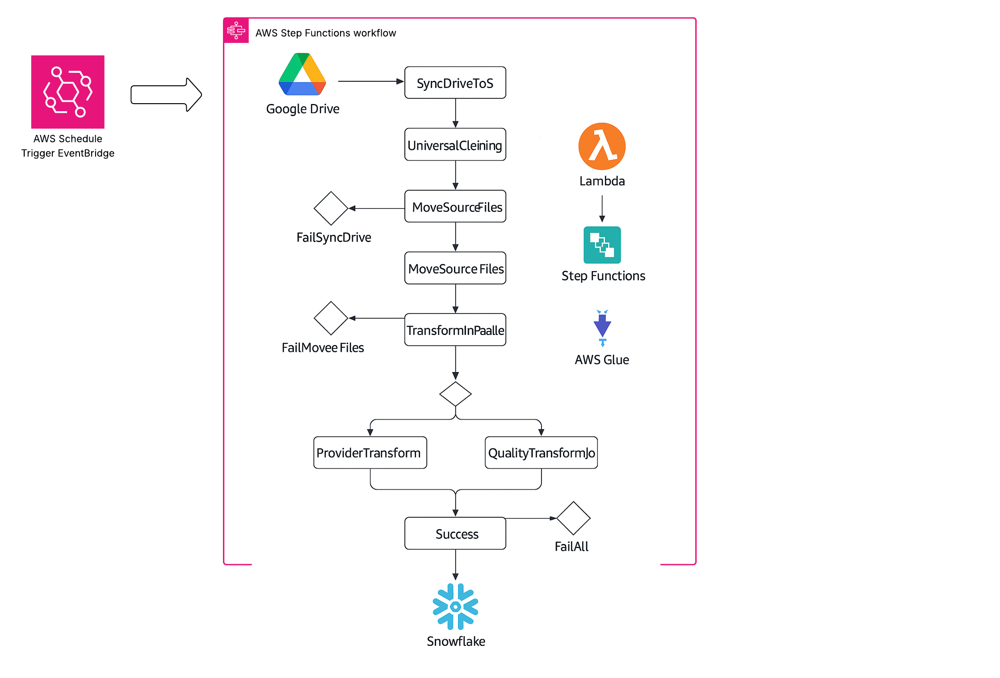
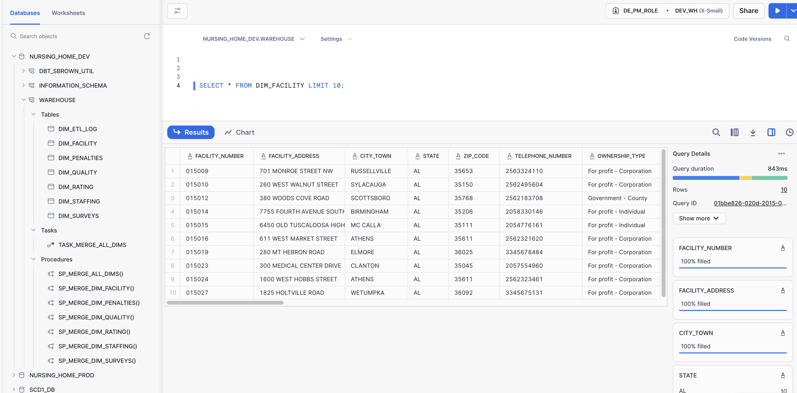

# Modern ETL Pipeline with AWS, Snowflake & PySpark
----

### 📘 Project Summary
Looking to build a robust, automated ETL pipeline? This project provides a step-by-step guide to designing and deploying a scalable data pipeline using AWS, Snowflake, and PySpark.

You’ll learn how to:
- 🔧 Set up cloud infrastructure with AWS (Glue, Lambda, Step Functions, S3)
- 📂 Ingest and manage data from Google Drive to a centralized data lake
- 🧬 Transform datasets using PySpark in AWS Glue
- ❄️ Load curated data into Snowflake for analytics and reporting
- ⏱ Automate workflows with AWS Step Functions and EventBridge

This project is ideal for data engineers looking to modernize their ETL workflows and bridge the gap between raw cloud storage and enterprise data warehousing.

---

<p align="center">
  
</p>

---

## 🛠 CloudFormation Deployment Order

### 1. 🧱 Stack: IAM & S3 Buckets
**File:** [`cloudformation/00_glue-iam-buckets.yml`](cloudformation/00_glue-iam-buckets.yml)

**Purpose:**
- Sets up IAM roles and S3 buckets used throughout the pipeline.

**Resources Created:**
| Resource     | Purpose                                          |
|--------------|--------------------------------------------------|
| IAM Roles    | Roles for Glue, Lambda, and Step Functions       |
| S3 Buckets   | For raw, staging, processed, and error storage   |

**Deployment:**
```bash
aws cloudformation deploy   --template-file cloudformation/00_glue-iam-buckets.yml   --stack-name glue-iam-buckets-stack   --parameter-overrides ProjectPrefix=nh Environment=dev   --capabilities CAPABILITY_NAMED_IAM
```

---

### 2. 🔁 Stack: Lambda for Google Drive Sync
**File:** [`cloudformation/01_lambda-s3-move-cleaned.yml`](cloudformation/01_lambda-s3-move-cleaned.yml)

**Purpose:**
- Sync files from Google Drive to S3 raw
- Move cleaned files from `staging/` to `processed/` or `error/`
- Validate required files before triggering Glue jobs

**Resources Created:**
| Resource                    | Purpose                                           |
|-----------------------------|---------------------------------------------------|
| SyncDriveToS3Function       | Ingests Google Drive files into S3                |
| MoveSourceFilesFunction     | Moves cleaned files from staging to processed     |
| ValidateStagingFilesFunction| Ensures required data is present for ETL start    |
| GoogleDriveDepsLayer        | Lambda layer for Google API                       |
| IAM Roles                   | Scoped to individual Lambda permissions           |

**Deployment:**
```bash
aws cloudformation deploy   --template-file cloudformation/01_lambda-s3-move-cleaned.yml   --stack-name lambda-s3-stack   --parameter-overrides ProjectPrefix=nh Environment=dev LambdaBucket=nh-source-657082399901-dev   --capabilities CAPABILITY_NAMED_IAM
```

---

### 3. 📂 Stack: Lambda to Move Final Files
**File:** [`cloudformation/02_lambda-move-files.yml`](cloudformation/02_lambda-move-files.yml)

**Purpose:**
- Moves cleaned files from `staging` to `processed` or `error` folders.

**Deployment:**
```bash
aws cloudformation deploy   --template-file cloudformation/02_lambda-move-files.yml   --stack-name lambda-move-files-stack   --parameter-overrides ProjectPrefix=nh Environment=dev LambdaBucket=nh-source-657082399901-dev   --capabilities CAPABILITY_NAMED_IAM
```

---

### 4. 🔬 Stack: Glue Jobs
**File:** [`cloudformation/03_glue-jobs.yml`](cloudformation/03_glue-jobs.yml)

**Purpose:**
- Define all Glue jobs for:
  - Universal data cleaning
  - Provider transformations
  - Quality metrics extraction

**Deployment:**
```bash
aws cloudformation deploy   --template-file cloudformation/03_glue-jobs.yml   --stack-name glue-jobs-stack   --parameter-overrides ProjectPrefix=nh Environment=dev   --capabilities CAPABILITY_NAMED_IAM
```

---

### 5. 🔄 Stack: Step Function Workflow
**File:** [`cloudformation/04_stepfunction-pipeline.yml`](cloudformation/04_stepfunction-pipeline.yml)

<p align="center">
  
</p>

**Purpose:**
- Orchestrates the full ETL pipeline:
  1. Sync Drive → Raw
  2. Universal Cleaning
  3. File Movement
  4. Staging Validation
  5. Parallel Glue Transforms

**Deployment:**
```bash
aws cloudformation deploy   --template-file cloudformation/04_stepfunction-pipeline.yml   --stack-name stepfunction-pipeline-stack   --parameter-overrides ProjectPrefix=nh Environment=dev   --capabilities CAPABILITY_NAMED_IAM
```

---

### 6. ⏰ Stack: EventBridge Trigger
**File:** [`cloudformation/05_eventbridge-trigger.yml`](cloudformation/05_eventbridge-trigger.yml)

**Purpose:**
- Sets a CRON trigger to run the pipeline daily at **5:00 PM ET**

**Schedule:**
```cron
cron(0 21 * * ? *) # 21:00 UTC = 5 PM ET (Daylight Time)
```

**Deployment:**
```bash
aws cloudformation deploy   --template-file cloudformation/05_eventbridge-trigger.yml   --stack-name eventbridge-trigger-stack   --parameter-overrides ProjectPrefix=nh Environment=dev   --capabilities CAPABILITY_NAMED_IAM
```

---

### 7. ⚙️ Step Function State Machine (Optional Direct JSON)
**File:** [`cloudformation/06_stepfunction.json`](cloudformation/06_stepfunction.json)

Used to define the workflow logic if not deploying via YAML.
You can import this in the Step Functions console or AWS CLI.

---

## ✅ Outcome
This modular pipeline automates data ingestion, validation, transformation, and storage using the best of AWS serverless services and Snowflake. It can be easily extended for additional sources and transformations.


----
# ❄️ Snowflake Integration and Warehouse Automation Setup

This document outlines the process of connecting your Snowflake instance to AWS S3 using a storage integration, staging data from S3 into Snowflake, and automating dimension table updates via stored procedures and scheduled tasks.

---

## 1️⃣ Role and Warehouse Setup
```sql
USE ROLE ACCOUNTADMIN;
USE WAREHOUSE DEV_WH;
```

---

## 2️⃣ Create Database and Storage Integration
```sql
CREATE OR REPLACE DATABASE REALTIME;

CREATE OR REPLACE STORAGE INTEGRATION S3_NH_REALTIME
  TYPE = EXTERNAL_STAGE
  STORAGE_PROVIDER = 'S3'
  ENABLED = TRUE
  STORAGE_AWS_ROLE_ARN = 'arn:aws:iam::657082399901:role/SCD1n2_Snow_Role'
  STORAGE_ALLOWED_LOCATIONS = ('s3://nh-transform-657082399901-dev/transform/');

DESC INTEGRATION S3_NH_REALTIME;
```

### 🔐 Grant Usage
```sql
USE ROLE SECURITYADMIN;
GRANT USAGE ON INTEGRATION S3_NH_REALTIME TO ROLE "DE_PM_ROLE";
```

---

## 3️⃣ Define File Format and External Stage
```sql
USE ROLE DE_PM_ROLE;

CREATE FILE FORMAT DATA_PIPELINE_DEV.FILE_FORMATS.PARQUET_FORMAT
  TYPE = 'PARQUET'
  COMPRESSION = 'snappy';

CREATE OR REPLACE STAGE DATA_PIPELINE_DEV.STAGES.S3_NH_STAGE_REALTIME
  STORAGE_INTEGRATION = S3_NH_REALTIME
  URL = 's3://nh-transform-657082399901-dev/transform/'
  FILE_FORMAT = DATA_PIPELINE_DEV.FILE_FORMATS.PARQUET_FORMAT;
```

### 📦 Sample Queries for Staged Files
```sql
LIST @DATA_PIPELINE_DEV.STAGES.S3_NH_STAGE_REALTIME;
SELECT * FROM @DATA_PIPELINE_DEV.STAGES.S3_NH_STAGE_REALTIME/facility;
SELECT * FROM @DATA_PIPELINE_DEV.STAGES.S3_NH_STAGE_REALTIME/qualitymsr_mds/;
```

---

## 4️⃣ Create Final Database and Schema
```sql
USE ROLE DE_PM_ROLE;
USE WAREHOUSE DEV_WH;

CREATE DATABASE IF NOT EXISTS NURSING_HOME_DEV;
USE DATABASE NURSING_HOME_DEV;
CREATE SCHEMA IF NOT EXISTS WAREHOUSE;
```

---

## 5️⃣ Logging Table for ETL Monitoring
```sql
CREATE OR REPLACE TABLE WAREHOUSE.dim_etl_log (
  log_id      NUMBER AUTOINCREMENT PRIMARY KEY,
  proc_name   STRING,
  status      STRING,
  message     STRING,
  logged_at   TIMESTAMP_NTZ DEFAULT CURRENT_TIMESTAMP()
);
```

---

## 6️⃣ Stored Procedure for Batch Dimension Merge
```sql
CREATE OR REPLACE PROCEDURE SP_MERGE_ALL_DIMS()
RETURNS STRING
LANGUAGE SQL
AS
$$
DECLARE
  error_msg STRING;
BEGIN
  BEGIN
    CALL SP_MERGE_DIM_FACILITY();
    CALL SP_MERGE_DIM_PENALTIES();
    CALL SP_MERGE_DIM_QUALITY();
    CALL SP_MERGE_DIM_RATING();
    CALL SP_MERGE_DIM_STAFFING();
    CALL SP_MERGE_DIM_SURVEYS();

    INSERT INTO WAREHOUSE.dim_etl_log (proc_name, status, message)
    VALUES ('SP_MERGE_ALL_DIMS', 'SUCCESS', 'All dimension merges completed successfully.');

    RETURN 'All dimension merge procedures completed successfully.';

  EXCEPTION
    WHEN OTHER THEN
      LET error_msg := 'One or more merges failed. Check procedure logs or tasks for details.';

      INSERT INTO WAREHOUSE.dim_etl_log (proc_name, status, message)
      VALUES ('SP_MERGE_ALL_DIMS', 'FAILURE', error_msg);

      RETURN error_msg;
  END;
END;
$$;
```

---

## 7️⃣ Scheduled Task to Run Nightly
```sql
CREATE OR REPLACE TASK task_merge_all_dims
  WAREHOUSE = DEV_WH
  SCHEDULE = 'USING CRON 30 19 * * * UTC'  -- 8:30 PM ET
AS
  CALL SP_MERGE_ALL_DIMS();

ALTER TASK task_merge_all_dims RESUME;
```

---

## 8️⃣ Monitor and Manual Execution
```sql
-- Monitor Task History
SELECT *
FROM TABLE(INFORMATION_SCHEMA.TASK_HISTORY())
WHERE NAME = 'task_merge_all_dims'
ORDER BY SCHEDULED_TIME DESC;

-- Manual Run Options
EXECUTE TASK task_merge_all_dims;
-- or
CALL SP_MERGE_ALL_DIMS();
```

---

This setup provides a complete workflow from S3 staging to Snowflake dimensional models with automated daily refresh and logging.
<p align="center">
  
</p>

---
### **Developer**
- **Shaunjay Brown**